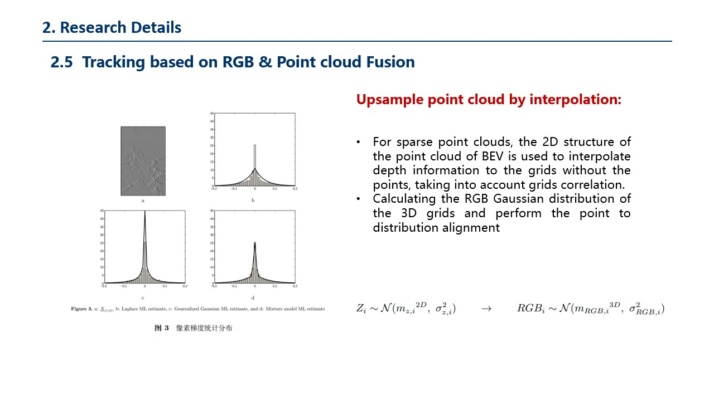

# Occlusion Handling Based on Motion Estimation
## Animation of slides

## Slides

# PrecisionTrackingBasedOnPointCloudAndRGBFusion

## Mini demo of RGB & point cloud Fusion Result

## Presentation of fused point cloud tracking

